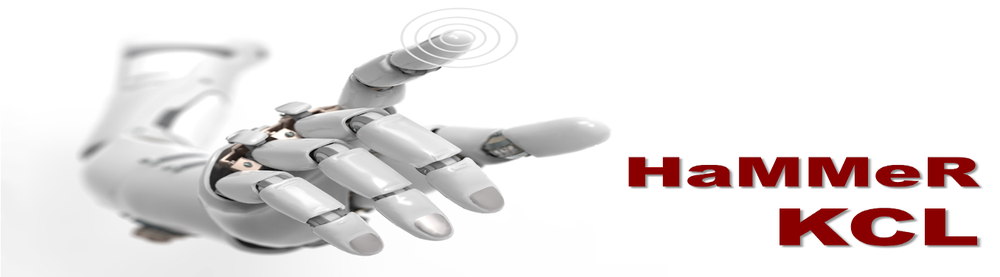

## HammerLab KCL :hammer:

Haptics refers to interaction involving touch. Haptic capability, both perception and action, is essential for a robot working in unstructured environments, yet robotic haptic technology today is still very primitive compared to even the simplest biological creatures. Haptic interaction is a cornerstone of many medical interventions/practices. Our lab designs robots with advanced haptic perception and interaction capabilities to address unmet needs in medicine, enabling safer and more effective diagnosis and treatment. We commit our work to benefit both patients and the medical profession while advancing the frontier of haptic robotics research.

### Research :books:
Applications of our research include:
> 1. [Robotic endoscopes](https://kclhammerlab.com/2018/research/soft-self-propelled-endoscopic-robot/)
> 1. [Haptic sensing for medical instruments](https://kclhammerlab.com/category/research/force-and-tactile-sensing/)
> 1. Force sensing and [control for steerable catheters for medical interventions](https://kclhammerlab.com/2018/research/robotic-catheter-for-cardiac-ablation/)
> 1. [Robotic ultrasound guidance](kclhammerlab.com/2018/research/ultrasound-imaging-using-parallel-soft-robotic-end-effector/)

### People :busts_in_silhouette:

* [**Dr. Hongbin Liu**](kclhammerlab.com/people/hongbin-liu/) (Director and Principal Investigator) 
* [**George Abrahams**](https://kclhammerlab.com/people/george-abrahams/) (PhD)
* [**Cao Danqian**](https://kclhammerlab.com/people/danqian-cao/) (PhD)
* [**Yue Li**](https://kclhammerlab.com/yue-li/) (PhD)
* [**Mikel De Iturrate Reyzabal**](https://kclhammerlab.com/people/mikel-de-iturrate-reyzabal-2/) (PhD)
* [**Dionysios Malas**](https://kclhammerlab.com/dionysios-malas/) (PhD)

### Contact us :mailbox:

The maintainer of this repository is **Mikel De Iturrate Reyzabal**. Contact me at: <mikel.de_iturrate_reyzabal@kcl.ac.uk> or <hammerlabkcl@gmail.com>
